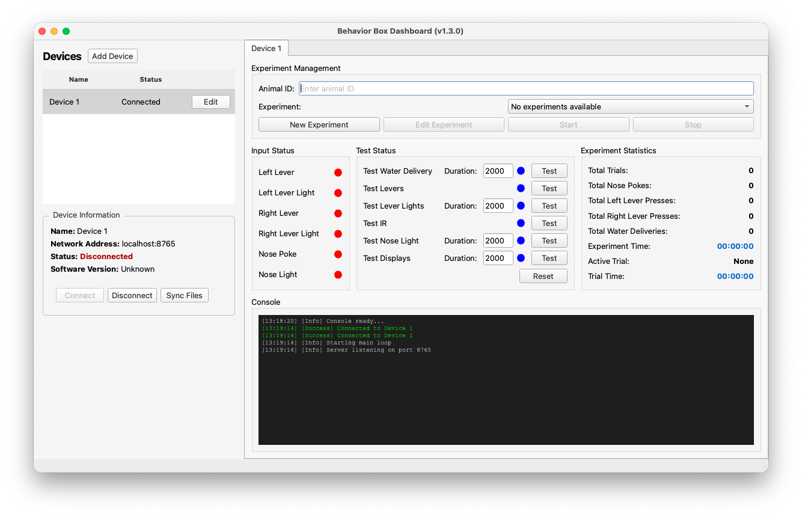

# Behavior Box Controller

This repository contains the code to control a behavior box utilizing IO and displays.

## Repository Structure

```
bbox_controller/
├── packages/              # Source code
│   ├── dashboard/        # Dashboard application (PyQt6 GUI)
│   ├── device/           # Device controller (runs on Raspberry Pi)
│   └── shared/           # Shared code between dashboard and device
├── apps/                 # Application-specific files
│   ├── dashboard/        # Dashboard config, requirements, start script
│   └── device/           # Device config, requirements, start script
├── tests/                # Test files organized by component
└── version.py            # Version tracking
```

## Requirements

### Software Dependencies

**Core Python Packages:**
- Python 3.11 or later
- `pygame` (game engine for simulation controls)
- `websockets` and `websocket-client` (network communication)
- `numpy` (numerical computations)
- `Pillow` (image processing for displays)
- `tk` (GUI framework for control panel)

**Raspberry Pi Packages:**
- `gpiozero` (GPIO control library)
- `adafruit-circuitpython-ssd1306` (OLED display driver)
- `adafruit-blinka` (CircuitPython compatibility)
- `lgpio` (low-level GPIO access)

**Optional Development Packages:**
- `pytest` (testing framework)

Dependencies are listed in `apps/dashboard/requirements.txt` and `apps/device/requirements.txt`. They are installed automatically based on the platform.

### Hardware Requirements

**Raspberry Pi Setup:**
- Raspberry Pi (tested on Raspberry Pi OS)
- Root/sudo access required for GPIO control
- I2C interface must be enabled

**GPIO Pin Mapping:**
- **GPIO 17**: IR beam sensor (nose poke detection)
- **GPIO 22**: Left lever LED indicator
- **GPIO 23**: Right lever press sensor
- **GPIO 24**: Left lever press sensor
- **GPIO 25**: Water delivery control
- **GPIO 26**: Right lever LED indicator
- **GPIO 27**: Nose port LED indicator

**I2C Displays:**
- Two SSD1306 OLED displays (128x64)
- Left display: I2C address `0x3C`
- Right display: I2C address `0x3D`
- Uses standard I2C pins (GPIO 2/3 for SDA/SCL)

## Raspberry Pi Setup

### Initial System Configuration

1. **Enable I2C Interface:**
   ```bash
   sudo raspi-config
   # Navigate to: Interface Options → I2C → Enable
   # Reboot when prompted
   ```

2. **Update system packages:**
   ```bash
   sudo apt update && sudo apt upgrade -y
   sudo apt install python3-pip python3-venv python3-dev -y
   ```

3. **Clone and setup the repository:**
   ```bash
   git clone <repository-url>
   cd bbox_controller

   # Create virtual environments (recommended)
   python3 -m venv venvs/device
   source venvs/device/bin/activate
   pip install -r apps/device/requirements.txt

   # For dashboard (on development machine)
   python3 -m venv venvs/dashboard
   source venvs/dashboard/bin/activate
   pip install -r apps/dashboard/requirements.txt
   ```

4. **Verify hardware detection:**
   ```bash
   # Test I2C devices (should show 0x3C and 0x3D)
   sudo i2cdetect -y 1
   ```

### Starting the Device

The device must run with root privileges to access GPIO:

```bash
cd apps/device
sudo ./start.sh
```

The script automatically activates the virtual environment (if present) and starts the device controller from `packages/device/main.py`.

### Troubleshooting

**Display Issues:**
- Confirm I2C is enabled: `sudo raspi-config` → Interface Options → I2C
- Check I2C device detection: `sudo i2cdetect -y 1` (should show 0x3C and 0x3D)
- Verify display addresses match the constants in `packages/device/hardware/constants.py`

**Simulation Mode Active:**
- If running on Raspberry Pi, an orange banner on the display indicates hardware communication issues
- Use keyboard controls for testing (see Simulation section below)
- Check logs in `apps/device/logs/device.log` for hardware initialization messages

## Dashboard

The dashboard facilitates wireless monitoring and control via Websockets.



### Running the Dashboard

```bash
cd apps/dashboard
./start.sh
```

The script automatically activates the virtual environment (if present) and starts the dashboard from `packages/dashboard/main.py`.

Use the *Connection* frame to connect to the device using an IP address and port number. The *Console* frame shows the live console output from the device. The *Input Status* frame shows the current state of the device IO with low latency. The *Test Status* frame allows the IO to be tested, specifically the water delivery, levers, and the IR beam.

### Experiment Management

**Basic Experiments**: To run a basic experiment, enter the animal ID in the *Experiment Management* frame and click the *Start* button.

**Timeline Experiments**: For advanced experiment protocols, use the timeline management system:

1. Click *Edit Timeline* to open the timeline editor
2. Create custom experiment protocols with multiple trial types
3. Save and manage timelines

## Device

### Simulation

You can run the device in simulation mode for development and testing without physical hardware. Simulation mode is activated automatically if hardware libraries (e.g., gpiozero) are unavailable.

### Controls in Simulation Mode

- **1**: Left Lever (hold to press)
- **2**: Right Lever (hold to press)
- **3**: Nose Poke (hold to activate)
- **Space**: Nose Poke (alternative)
- **J**: Left Lever Light
- **K**: Nose Poke Light
- **L**: Left Lever Light
- **ESC**: Exit

### Hardware Usage

The device controller runs on the device and communicates with the control panel software via WebSocket connections over the network.

After the device software has started, the network IP address of the device will be shown on the display.

## Device Operation

### Log Files

Logs are saved in the respective `apps/*/logs/` directories:
- **`apps/device/logs/device.log`** - Device controller startup events, runtime output, and experiment data
- **`apps/dashboard/logs/dashboard.log`** - Dashboard startup and runtime events

### Data Files

Data files are stored under the device data directory in individual JSON files named `[Animal ID]_[Date]_[Time].json`. A data file is generated for *each* experiment run. Currently, data files are only stored locally and must be copied via USB or uploaded online to platforms such as Box or RIS. All timestamps use ISO 8601 format (`YYYY-MM-DDTHH:MM:SS.microseconds`). The major headings within a data file are listed below, and an example is also shown.

### `experiment_metadata`

Contains metadata about the experiment session including animal identification, timing, configuration parameters, and the experiment definition with trial specifications.

### `experiment_trials`

Records all trials during the experiment, including behavioral events, trial outcomes, and timings. Each trial contains a chronological sequence of events with timestamps.

### `experiment_statistics`

Provides summary statistics for the entire experiment session, including counts of lever presses, nose pokes, and water deliveries.

Example Output:

```json
{
  "experiment_metadata": {
    "animal_id": "test_00",
    "experiment_start": "2025-08-29T11:12:18.836449",
    "experiment_end": "2025-08-29T11:12:35.709546",
    "config": {
      "iti_minimum": 100,
      "iti_maximum": 1000,
      "response_limit": 1000,
      "cue_minimum": 5000,
      "cue_maximum": 10000,
      "hold_minimum": 100,
      "hold_maximum": 1000,
      "valve_open": 100,
      "punish_time": 1000
    },
    "experiment_file": {
      "name": "Test Experiment",
      "trials": [
        {
          "type": "Stage3",
          "id": "Stage3_0",
          "parameters": {
            "cue_duration": 5000,
            "response_limit": 1000,
            "water_delivery_duration": 2000
          }
        }
      ],
      "version": "1.0",
      "loop": true
    }
  },
  "experiment_trials": [
    {
      "trial_outcome": "success",
      "events": [
        {
          "type": "left_lever_press",
          "timestamp": "2025-08-29T11:12:26.558849"
        },
        {
          "type": "nose_port_entry",
          "timestamp": "2025-08-29T11:12:28.607925"
        },
        {
          "type": "reward_triggered",
          "timestamp": "2025-08-29T11:12:30.101765"
        }
      ],
      "trial_start": "2025-08-29T11:12:31.892916",
      "trial_end": "2025-08-29T11:12:31.892917",
      "trial_type": "trial_stage_3"
    }
  ],
  "experiment_statistics": {
    "nose_pokes": 3,
    "left_lever_presses": 2,
    "right_lever_presses": 2,
    "trial_count": 4,
    "water_deliveries": 1
  }
}
```

### Version Tracking

The device code includes version tracking to help identify which version is running on the device. The version is stored in the shared module and is displayed on the device screen and logged in the control panel.

## Issues and Feedback

Please contact **Henry Burgess** <henry.burgess@wustl.edu> for all code-related issues and feedback.

## License

<!-- CC BY-NC-SA 4.0 License -->
<a rel="license" href="http://creativecommons.org/licenses/by-nc-sa/4.0/">
  
</a>
<br />
This work is licensed under a <a rel="license" href="http://creativecommons.org/licenses/by-nc-sa/4.0/">Creative Commons Attribution-NonCommercial-ShareAlike 4.0 International License</a>.
